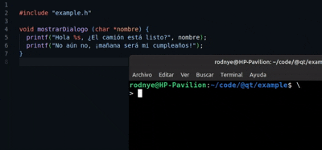
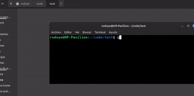

<div align="center">
  
  
  <h1>QT Pear</h1>
  <p>Herramientas de línea de comandos para proyectos en QT</p>
</div>

[](https://github.com/rodnydevcujae/qtpear/actions/workflows/npm-publish.yml)

QT Pear es un conjunto de herramientas de línea de comandos diseñadas para facilitar la transpilación[¹](https://es.wikipedia.org/wiki/Transpilador) de proyectos en QT.  
Realizado para el cumplimiento de los requisitos de [Introducción a la Programación](https://moodle.cujae.edu.cu/course/info.php?id=895) del curso 2024-2025 en la [CUJAE](https://cujae.edu.cu). 

## Tabla de contenido 📚
1. [Instalación](#instalación-️)
2. [Características](#características)
   - [Transpilador de caracteres especiales](#1-transpilador-de-caracteres-especiales-)
   - [Creador de proyectos](#2-creador-de-proyectos-)
   - [Auto prototipado](#3-auto-prototipado-)
   - [Auto indexado](#4-auto-indexado-)
3. [¿Por qué usar Qtpear?](#por-qué-usar-qtpear-)
   - [Transpilado de caracteres](#transpilado-de-caracteres-)
   - [Creador de proyectos](#creador-de-proyectos-)
   - [Auto prototipado](#auto-prototipado-)
5. [Licencia](#licencia)


## Instalación ⚙️

Esta herramienta fue desarrollada con NodeJS, por lo que su instalación será realizada con npm:

```bash
npm install -g qtpear
```

Una vez instalado, puede comprobar si esta funcionando correctamente:

```bash
qtpear --version
```

Para ver la documentación integrada ejecute:
```bash
qtpear -h
```

## Características

### 1. Transpilador de caracteres especiales 🔄
Asegura la compatibilidad con la CMD de Windows al manejar caracteres especiales y tildes.

<div align="center">
  
</div>

---

### 2. Creador de proyectos 📁
Crea proyectos a partir de plantillas ya predefinidas.

<div align="center">
  
</div>

---

### 3. Auto prototipado 🛠️
Actualiza automáticamente todos los archivos de encabezado (*.h) con sus prototipos.

<div align="center">
  
</div>

---

### 4. Auto indexado 📑
Actualiza automáticamente el archivo de proyecto (*.pro) con todos los archivos C en los subdirectorios.

<div align="center">
  
</div>

## ¿Por qué usar Qtpear? 🤔
Esta es una herramienta personal para automatizar tareas repetitivas, además de que si eres usuario Linux, puedes crear software compatible con Windows utilizando estas utilidades.

### Transpilado de caracteres 🔄
La terminal de Windows, a diferencia de otros sistemas tales como Linux, utiliza de manera predeterminada una codificación de caracteres DIFERENTE a UTF-8, por lo que los típicos caracteres de escape ASCII no son soportados. Presenta una forma de representación que para el parecer de muchos es _extraña_:
```c
printf("\240"); // á
printf("\202"); // é
printf("\265"); // Á
``` 

Qtpear tiene el comando `parse` que clonará y convertirá el siguiente código:
```c
#include "example.h"

void mostrarDialogo (char *nombre) {
  printf("Hola %s, ¿El camión está listo?\n", nombre);
  printf("No aún no, ¡mañana será mi cumpleaños!");
}
```

A este código:
```c
#include "example.h"

void mostrarDialogo (char *nombre) {
  printf("Hola %s, \250El cami\242n est\240 listo?\n", nombre);
  printf("No a\243n no, \255ma\244ana ser\240 mi cumplea\244os!");
}
```

Simplificando así el flujo de desarrollo y evitar recordar la extensa e incómoda [tabla de caracteres](./src/services/characters-table.ts)

### Creador de proyectos 📁
El QT5.3 ya viene con un creador de proyectos predeterminado, pero... ¿y si lo mejoramos con los requerimientos del curso?

Así, el comando `create` preguntará que plantilla utilizar y el nombre del proyecto.
Esta es la plantilla _logic_
```
─ example/
   ├─ example.pro
   │
   ├─ Logica/
   │   ├─ logica.c
   │   └─ logica.h
   │
   └─ Interfaz/
       ├─ interfaz.c
       └─ interfaz.h

```

### Auto prototipado 📝
En algunos casos cuando el proyecto crece en tamaño, comienza a complicarse el mantenimiento de los prototipos de las funciones. Puede  resultar problemático y aumenta la posibilidad de escribir los prototipos con errores.  
Qtpear presenta el comando `auto header` que detectará todos los archivos C y autogenerará en sus respectivos archivos de encabezado (\*.h) los prototipos.   
Así los archivos:
```h
// Archivo: example.h
#include <math.h>

int malPrototipo(int x, char *word);
```

```c
// Archivo: example.c
#include "example.h"

int sumar(int x, int y) {
  return x * y;
}

int distancia(int x1, int x2, int y1, int y2) {
  return sqrt(
    pow(x1 - x2, 2) + pow(y1 - y2, 2)
  );
}
```

Actualizará el encabezado eliminando los prototipos no encontrados e insertando los actuales:
```c
// Archivo: example.h
#include <math.h>

int sumar(int x, int y);
int distancia(int x1, int x2, int y1, int y2);
```


## Licencia

Este proyecto está bajo la Licencia MIT. Consulta el archivo [LICENSE](LICENSE.txt) para más detalles.

---

Coded by [Rodny Estrada](https://github.com/rodnydevcujae)

